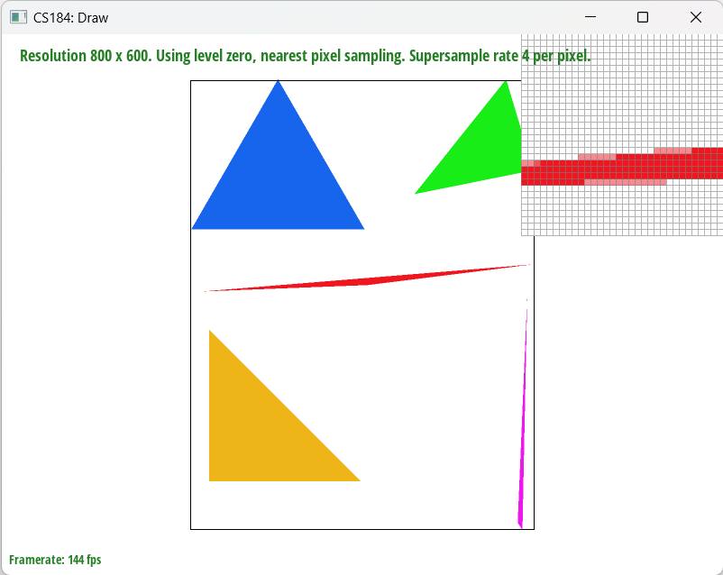
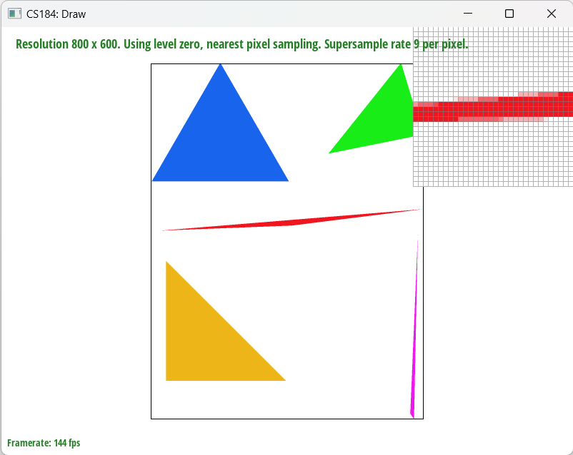
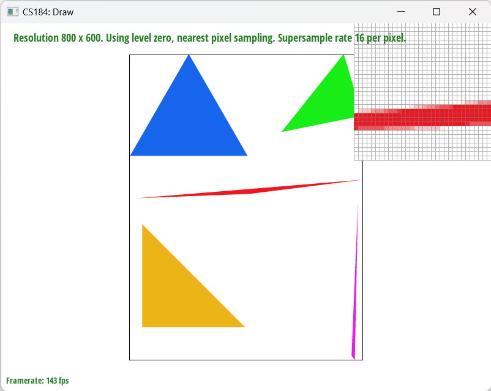
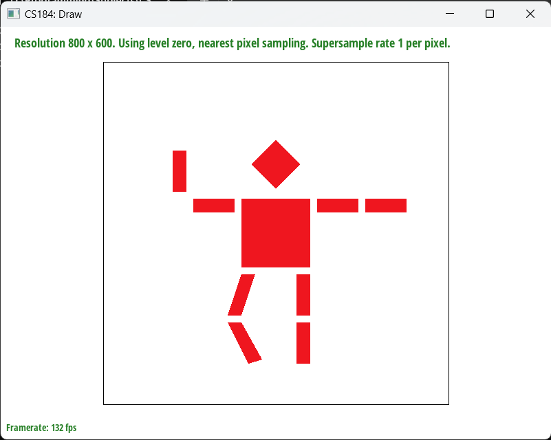
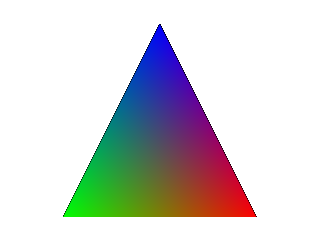
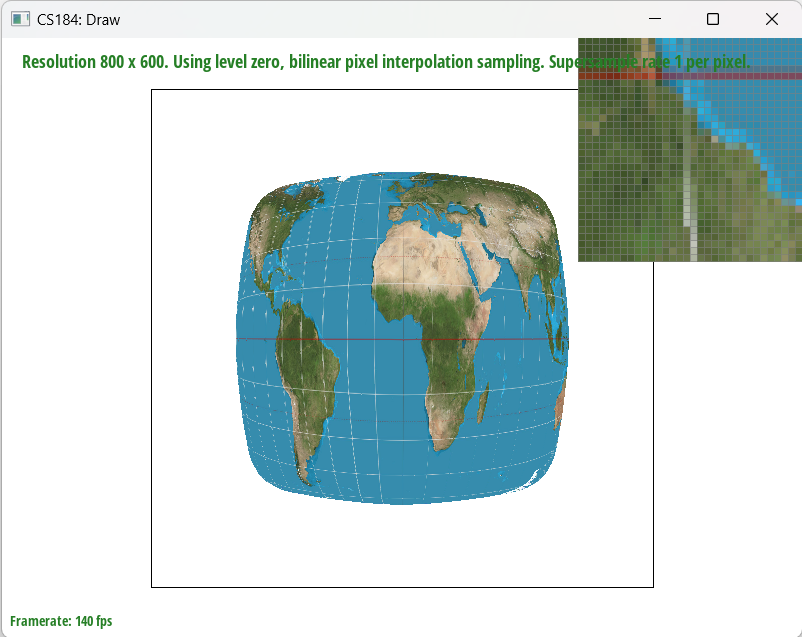
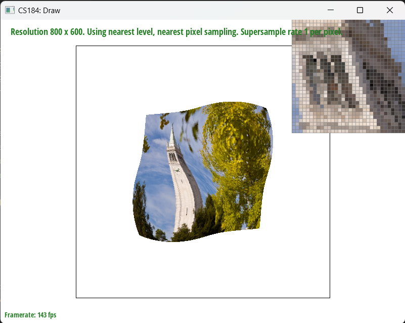
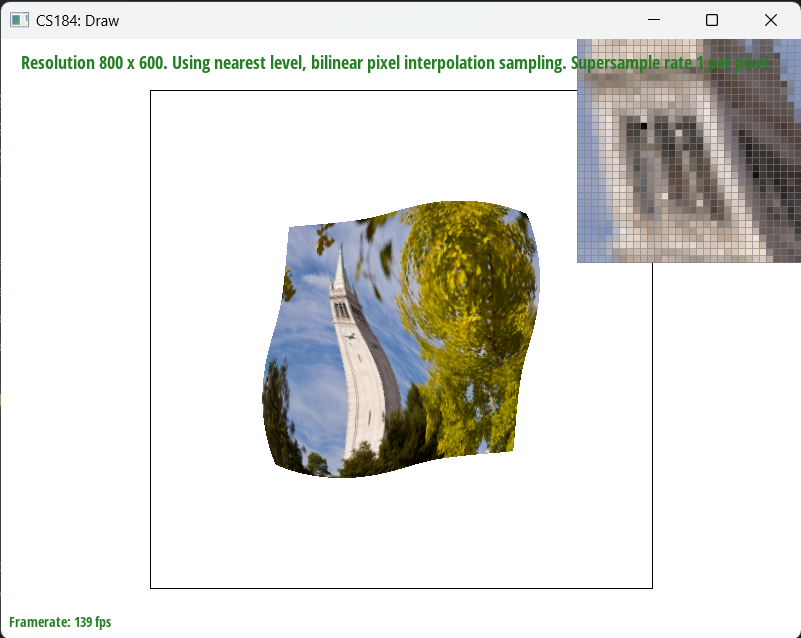

# CS184 Project 1 (Rasterizer) Writeup

> Spring 2023, Yunhao Cao and Yuqi Zhai

## Overview
We implemented every single task in the project, we believe that throughout this journey the most challenging part is to tweak many edge cases that would lead to crashes in the program. Also, through this project we really see how algorithm complexity affects response time in a CG program, even a complexity change of 2x can cause a huge difference in the response time.

## Section 1: Rasterization
### Part 1: Rasterizing single-color triangles

In part 1 of this project, we are given a bunch of points representing a triangle, and a `Color` object containing the `r, g, b` values of the color with the triangle with. The challenge here is that:
1. We need to identify if a specific screen pixel is within the triangle / on the border of the triangle / outside of the triangle.
2. We need to determine which of the above cases to fill the pixel with the color of the triangle.

Our approach is:

1. We rasterized the triangles through 3 large steps. 
   1. The first step is calculating whether each pixel is inside the triangle or not. We used the exact same procedure as the one mentioned in lecture, where we compute 
      1. the normal vector for each edge out of 3 edges
      2. the dot product between the vector from the starting vertex of the edge vector to the point and the normal vector
      3. the dot product between the vector from the starting vertex of the edge vector to the remaining vertex and the normal vector
    2. and then we compare the signs of both dot products. 
       1. If they are the same, it means the point is on the correct side of the half-plane. 
    3. The third step is to determine whether the point on the edge is on a top edge or left edge. 
       1. We determine a top edge by first determining whether it is a horizontal edge and then find out if the other vertex not on this edge has a bigger y-coordinate. 
       2. Similarly, we determine a left edge by first ensuring the edge is not horizontal and one vertex of the edge should have the minimum x-value among all three vertices. 
2. We ensured the efficiency algorithm by first calculating the minimum and maximum x and y value, and only iterated inside this box instead of the entire buffer frame.


### Part 2: Antialiasing by Supersampling
In this part, we are given a triangle and a color, and we need to rasterize the triangle with antialiasing technique. The reason why we need to do this is because the resolution of the screen usually does not match with the edge of the triangles perfectly and through supersampling we can get a better approximation of the shape of the triangle edges through smoother color transitions.

1. Our supersampling algorithm is quite simple and intuitive. 
   1. We changed the shape of sample_buffer from `width * height` to `width * height * sample_rate`, where sample_rate is the number of samples we want to take in each pixel.
   2. To rasterize the triangles with supersampling, in addition to the original 2 for loops for iterate through the frame, we add in 2 additional for loops to iterate over multiple locations in the single pixel location(with the upper limit of both loops being the square root of the sample rate). 
      1. Within each iteration, we will again test whether the (supersampled) point is inside the triangle and fill in the pixel through `fill_pixel` function. 
         1. We modified this function to accomodate for the addition of sample points. We added in 2 additional parameters, which correspond to the additional supersampling location inside each pixel, and recalculate the index that each sub-pixel supersampled in the sample buffer, and fill in the color. 
   3. The last step we modified is the `resolve_to_frame_buffer` function. Instead of a one-to-one relationship in task 1, we first sum over all the colors in each pixel due to supersampling (summing up each rgb value of the indices corresponding to the pixel in the sample buffer) and average them by dividing by the `sample_rate`. Then we assign the overall rgb value for the pixel in the frame buffer. 
2. In short, we did not change the rasterization pipeline, but rather modified the rasterize_triangle and resolve_to_frame_buffer function to make it support supersampling. That being said, supersampling is useful especially in terms of antialiasing the triangles intuitively because it samples more points inside each pixel and averages over the color to output one single color to the frame buffer, which in turn **resembles downsampling from a high resolution image**. This works especially well at the edge of each triangle, since there will be drastic change of color from inside the triangle to the background on the edge. Hence by averaging over all colors of the supersampled points for this pixel, the color will not be such a drastic change, instead it will be a milder color, therefore antialiasing accomplished. 

|Image|Image|
|-|-|
| <br/> Sample Rate: 1 per px| <br/> Sample Rate: 4 per px|
| <br /> Sample Rate: 9 per px| <br /> Sample Rate: 16 per px|

> Analysis: As sample rate increases, we see a smoother transition of color at the edge of the triangle.

### Task 3: Transforms

For this task we implemented 3 functions that involves transformations in the 2D plane. Here is a picture of rendered (and modified) little robot picture using those functions.



### Task 4: Barycentric coordinates
In this task, we are asked to rasterize triangles with interpolated color values. The challenge here is that we need to determine the color of each pixel inside the triangle.

Barycentric coordinate is a coordinate system for triangles of the form (alpha, beta, gamma), each representing the **proportion of distance of a point relative to the three vertices**. This is extremely useful in interpolation of color, texture coordinate, etc. We calculate the proportion distance by calculating the perpendicular distance from the point to the opposite edge. By utilizing the three proportions, we could, in this case, interpolate the color of each point inside the triangle via blending the colors of the three vertices. 



By borrowing this picture from the Internet, we could see as we move away from the red vertex, the interpolation of color will become less and less red since the distance from that vertex to the point is becoming larger, hence a smaller influence. The same works for the vertices with blue and green color.


### Task 5: "Pixel sampling" for texture mapping

Pixel sampling is sampling the texture map through uv coordinates to get the texture element encoded that is either nearest to the uv coordinate given on the texture map or through bilinear interpolation to get an intermediate texture element, similar to getting the color parameter we are given in rasterizing a triangle in previous tasks. 

1. Similar to the last task, We first use barycentric coordinates through x,y coordinates and then use the alpha, beta, and gamma generated to get the interpolated uv coordinate. 
2. Then we query the corresponding mipmap level (for this task, it's fixed to be 0) to get the texture map through either nearest or bilinear. 
   1. For nearest, we first multiply `u,v` by texture's `width` and `height` respectively, and round that number to get the nearest pixel on texture corresponding to the `u,v` position. 
   2. For bilinear, we do 2 interpolations within the nearest 4 texture pixels, and get a s and t proportion; then utilize that to interpolate the “intermediate” texture element, which we will fill the pixel with. 
3. It is clear from the pixel inspector that if we are using nearest pixel sampling, the white line that is supposed to run across the entire globe is just dots scattered around, while if we take a look at the bilinear interpolation sampling, we could clearly see the white longitudinal and latitudinal line running across the texture. I think this large difference is caused when there is a sharp change in texture, so nearest sampling will just take the nearest texture element, which could be just white or blue in this case; but bilinear sampling will be able to take blue and white, blending them together to give a much smoother transition. This caused the difference in the result showed below.

|Image|Image|
|-|-|
| <br/>Nearest Sampling with 1 samples per pixel| <br/>Bilinear Sampling with 1 samples per pixel|
| <br/>Nearest Sampling with 16 samples per pixel| <br/>Bilinear Sampling with 16 samples per pixel|

### Task 6: "Level sampling" with mipmaps for texture mapping

Level sampling is using appropriate mipmap levels to avoid sampling multiple texture pixels for a single on-screen pixel. Mipmaps are basically a set of pre-sampled textures at different resolutions, and we can use the derivative of the uv coordinates to determine which mipmap level to use.

I implemented Level sampling by first computing the derivative of the uv coordinates

We will use $x,y$ to represent the pixel coordinates on the screen, $u,v$ to represent the uv coordinates on the texture map, and $t_x, t_y$ to represent pixel coordinates on the original texture map at level 0.

$$
\frac{d t}{dx} = \biggl|\biggl|\begin{bmatrix}
\frac{d u}{dx} \cdot width \\
\frac{d v}{dx} \cdot height
\end{bmatrix}\biggl|\biggl|_2
$$

$$
\frac{d t}{dy} = \biggl|\biggl|\begin{bmatrix}
\frac{d u}{dy} \cdot width \\
\frac{d v}{dy} \cdot height
\end{bmatrix}\biggl|\biggl|_2
$$

We know $\frac{dt}{dx}$ and $\frac{dt}{dy}$ both represents the movement of the texture pixels(regard less of direction) on the texture map when we move one pixel on the screen. Then since each increase in level of mipmap results in half the resolution of the previous level(1/4x the pixels), we can use the following formula to determine the appropriate mipmap level to use:

$$
D = \max\biggl(\log_2\biggl(\frac{dt}{dx}\biggr), \log_2\biggl(\frac{dt}{dy}\biggr)\biggr)
$$

Sometimes $D$ is computed to be $D < 0$ or $D >= \text{mipmap.size()}$, so we need to clamp $D$ to be in the range. Those values happen because we might zoom in the image so much that the texture pixels on the screen are larger than the original texture map, or we might zoom out so much that multiple pixels on the smallest mipmap corresponds to one pixel on screen. We can't do too much about it so we just clamp its range. 

After we get the appropriate mipmap level, depending on our level sampling method

1. Zero level sampling: we just use the level 0 mipmap and use the code in task 5 to perform sampling
2. Nearest level sampling: we just use the nearest level `round(D)` and use the code in task 5 to perform sampling
3. Linear level sampling: we use the two nearest levels `floor(D)` and `ceil(D)` and use the code in task 5 to perform sampling. Then we use the following formula to interpolate the two results:

```C++
Color lowerC = task5(psm, floor(D), u, v);
Color upperC = task5(psm, ceil(D), u, v);
Color result = lowerC * (ceil(D) - D) + upperC * (1-(ceil(D) - D));
```

Tradeoffs:


|Pixel Sampling Method|Level Sampling Method|Memory Footprint|Computational Cost|Antialiasing Power|
|-|-|-|-|-|
|`P_NEAREST`|`L_ZERO`|`1x`|`1x`|`1x`|
|`P_LINEAR`|`L_ZERO`|`2x`|`2x`|`2x`|
|`P_NEAREST`|`L_NEAREST`|`3x`|`1x`|`1x-4x`|
|`P_LINEAR`|`L_NEAREST`|`5x`|`2x`|`2x-8x`|
|`P_NEAREST`|`L_LINEAR`|`4x`|`2x`|`2x-8x`|
|`P_LINEAR`|`L_LINEAR`|`6x`|`4x`|`4x-16x`|

Visualizations:

|Pixel Sampling Method|Level Sampling Method|Result|
|-|-|-|
|`P_NEAREST`|`L_ZERO`||
|`P_LINEAR`|`L_ZERO`||
|`P_NEAREST`|`L_NEAREST`||
|`P_LINEAR`|`L_NEAREST`||
|`P_NEAREST`|`L_LINEAR`||
|`P_LINEAR`|`L_LINEAR`||


Credit and Side notes:

> Webpage hosted at [quantumcookie.xyz/Opensourced-Study-Notes-Berkeley/CS184/proj1-rasterizer-writeup](https://quantumcookie.xyz/Opensourced-Study-Notes-Berkeley/CS184/proj1-rasterizer-writeup)